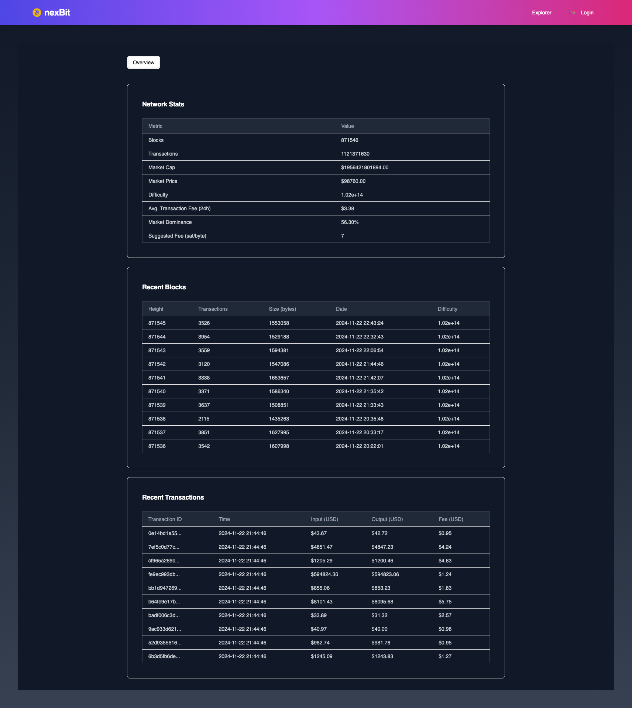
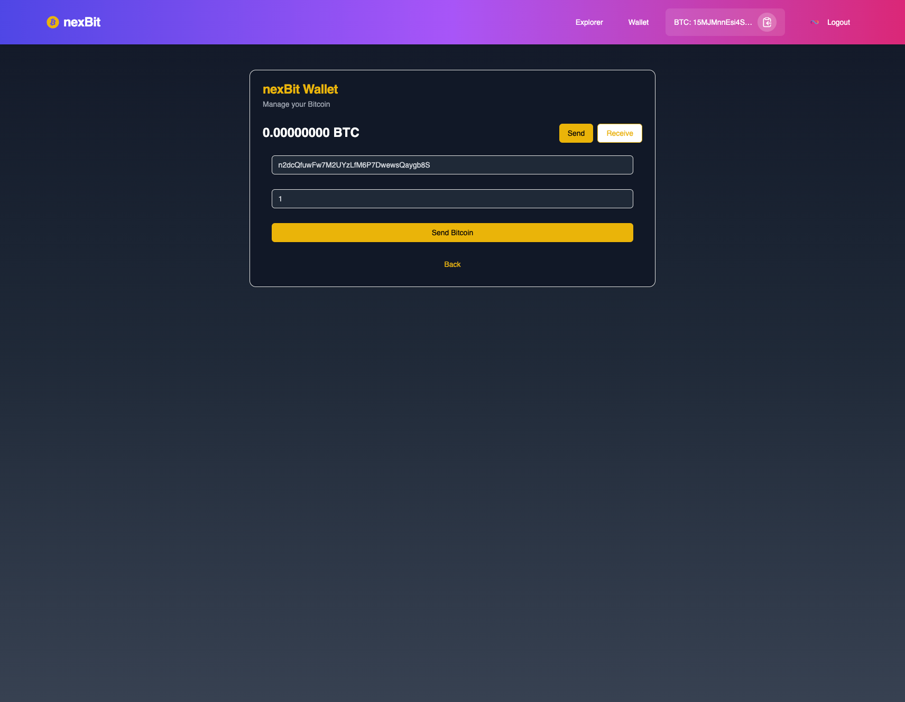
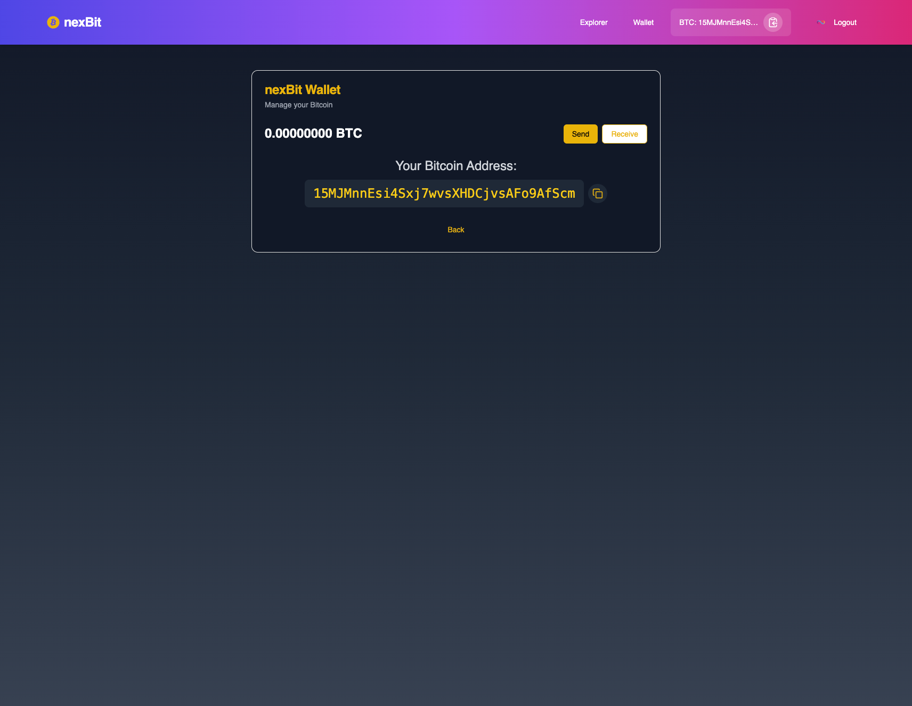
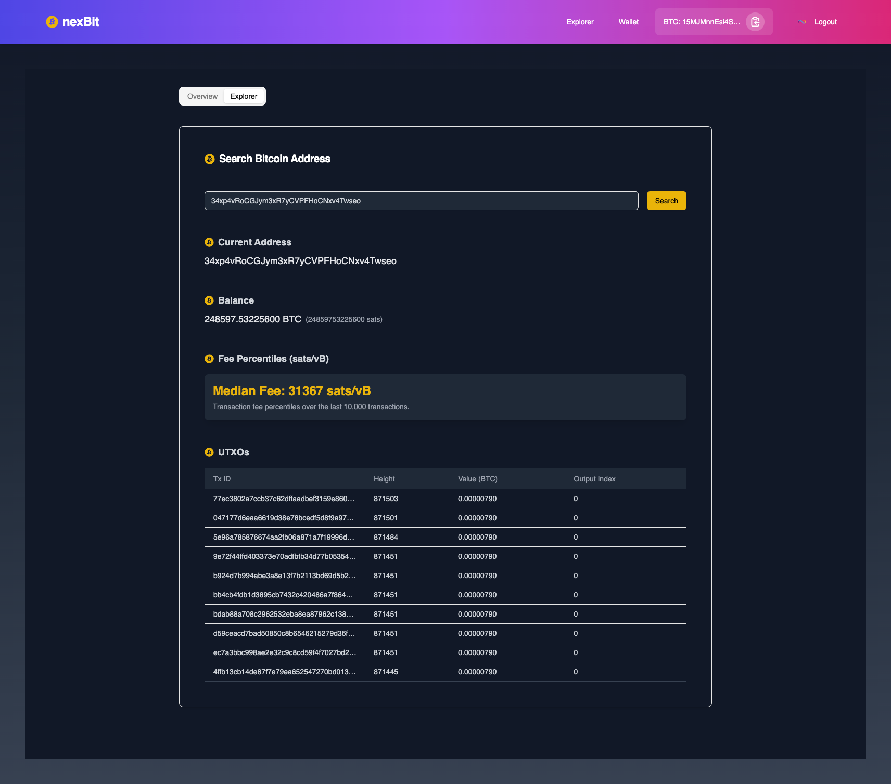

# nexBit Wallet


**Manage your Bitcoin securely on the Internet Computer.**

[**Live Demo**](https://uukoy-xaaaa-aaaap-anubq-cai.icp0.io/)  
[**Watch the Demo on YouTube**](https://youtu.be/qFVmAdIP3Dk)

---

## Table of Contents

- [Introduction](#introduction)
- [Features](#features)
- [Live Demo](#live-demo)
- [Installation Instructions](#installation-instructions)
- [Backend Canister Methods](#backend-canister-methods)
- [Bitcoin Integration](#bitcoin-integration)
- [Explorer Features](#explorer-features)
- [License](#license)
- [Contributing](#contributing)
- [Screenshots](#screenshots)
- [Contributor and Creator](#contributor-and-creator)
- [Acknowledgments](#acknowledgments)

---

## Introduction

**nexBit Wallet** is a multiuser Bitcoin wallet and explorer built on the Internet Computer Protocol (ICP). It allows users to securely send, receive, and manage Bitcoin using their Internet Identity while providing rich insights into Bitcoin transactions and network data.

---

## Features

### Wallet

- **Login with Internet Identity**: A secure and private way to manage your Bitcoin wallet.
- **Send and Receive Bitcoin**: Easily send and receive Bitcoin from other addresses.
- **Real-time Balance Updates**: Fetch your Bitcoin balance directly from the blockchain.
- **Secure Transactions**: Powered by ICP's decentralized infrastructure.

### Explorer

- **Search Bitcoin Addresses**: View the balance, UTXOs, and transaction details of any Bitcoin address.
- **Transaction Fee Insights**: Real-time transaction fee percentiles (sats/vB) for better decision-making.
- **Network Block Headers**: Explore recent block headers and hashes in the Bitcoin network.
- **UTXO Details**: Analyze unspent transaction outputs (UTXOs) for any address.
- **Rich Visualizations**: Graphical representation of fee data and other blockchain statistics.

---

## Live Demo

Experience the nexBit Wallet live:  
[**Live Demo**](https://uukoy-xaaaa-aaaap-anubq-cai.icp0.io/)

---

## Installation Instructions

### Prerequisites

- [Node.js](https://nodejs.org/) and [npm](https://www.npmjs.com/)
- [dfx (Dfinity SDK)](https://internetcomputer.org/docs/current/developer-docs/setup/install/)
- Docker (optional for dev containers)

### Steps to Set Up

1. **Clone the Repository**:

   ```bash
   git clone https://github.com/noah-sheldon/nexBit.git
   cd nexBit
   ```

2. **Install Dependencies**:

   ```bash
   npm install
   ```

3. **Start the Internet Computer Local Development Environment**:

   ```bash
   dfx start --background --clean
   ```

4. **Deploy Canisters**:

   ```bash
   dfx deploy
   ```

5. **Run the Frontend**:

   ```bash
   npm start
   ```

6. Access the Application: Open your browser and navigate to http://localhost:3000.

### **Internet Identity and Its Use**

- **Internet Identity (II)** is a privacy-preserving authentication system provided by the Internet Computer Protocol (ICP).
- It allows users to securely log in to decentralized applications without relying on:
  - Traditional usernames
  - Passwords
  - Third-party identity providers
- **Key Features**:
  - Ensures users' data remains private and secure using cryptographic techniques.
  - Provides seamless and secure interactions with decentralized applications.
- **Usage in nexBit Wallet**:
  - Used to authenticate users securely.
  - Links Bitcoin wallets to unique cryptographic identities.
  - Eliminates the need to store sensitive information like passwords.
  - Enhances security and privacy for wallet users.

---

### **HTTP Outcalls in ICP**

- HTTP outcalls enable **canisters (smart contracts)** on the Internet Computer to make outbound requests to external web services.
- **Benefits**:
  - Extends the functionality of decentralized applications.
  - Allows interactions with data and APIs beyond the ICP ecosystem.
- **Usage in nexBit Wallet**:
  - Utilized to access external blockchain data providers, such as **Blockchair**.
  - Fetches detailed Bitcoin data, including:
    - Bitcoin address information.
    - Transaction details.
    - Network data and analytics.
  - Enables real-time insights and analytics while maintaining a decentralized architecture.
- **Considerations**:
  - Since HTTP outcalls involve centralized systems, they must be handled carefully to align with ICP's decentralized principles.

## Backend Canister Methods

### 1. Get P2PKH Address

- Retrieve the Bitcoin Pay-to-PubKey-Hash (P2PKH) address associated with the calling principal.

  ```rust
  get_p2pkh_address: () → (text)
  ```

  **Call Example**:

  ```bash
  dfx canister call backend get_p2pkh_address
  ```

### 2. Get Balance

- Retrieve the Bitcoin balance of the address associated with the calling principal.

  ```rust
  get_balance: () → (nat64)
  ```

  **Call Example**:

  ```bash
  dfx canister call backend get_balance
  ```

### 3. Send Bitcoin

- Send Bitcoin to a specified destination address.

  ```rust
  send_from_p2pkh: (record { destination_address: text; amount_in_satoshi: nat64 }) → (text)
  ```

  **Call Example**:

  ```bash
  dfx canister call backend send_from_p2pkh '(record { destination_address = "DESTINATION_ADDRESS"; amount_in_satoshi = 100000 })'
  ```

## **Bitcoin Integration**

This project uses the **Bitcoin Integration API** on the Internet Computer. It enables seamless interactions with the Bitcoin blockchain.

---

## **Explorer Features**

### **Search Bitcoin Addresses**

Search for any Bitcoin address and get detailed information, including:

- **Current Balance**
- **List of UTXOs (Unspent Transaction Outputs)**
- **Transaction Details**

### **Transaction Fee Percentiles**

Analyze real-time Bitcoin transaction fees using percentile data:

- **Median Fee**
- **Low and High Percentile Ranges**

### **Network Block Headers**

- Explore the latest block headers and block hashes from the Bitcoin network.

### **UTXO Analysis**

View unspent transaction outputs for any address, including:

- **Transaction ID**
- **Value in BTC**
- **Block Height**

## **Screenshots**

### **Dashboard**

The main dashboard provides an overview of your Bitcoin wallet, including your balance and quick access to sending and receiving Bitcoin.



---

### **Send Bitcoin**

Easily send Bitcoin by entering the recipient's address and the amount to send, all in a simple interface.



---

### **Receive Bitcoin**

Securely generate and display your Bitcoin address to receive funds.



---

### **Explorer**

Explore Bitcoin blockchain details, including balances, transactions, UTXO data, and network stats.



---

## **License**

This project is licensed under the **MIT License**.

---

## **Contributing**

We welcome contributions! If you have ideas for improving the project, feel free to:

1. Fork the repository.
2. Create a new branch.
3. Submit a pull request.

For major changes, please open an issue first to discuss your ideas.

---

## **Contributor and Creator**

- **GitHub**: [noah-sheldon](https://github.com/noah-sheldon)
- **Follow me on X (Twitter)**: [noah\_\_sheldon](https://x.com/noah__sheldon)
- **LinkedIn**: [noah--sheldon](https://www.linkedin.com/in/noah--sheldon/)

## **Acknowledgments**

Special thanks to the Internet Computer community and the Bitcoin Integration team for making decentralized applications seamless.
